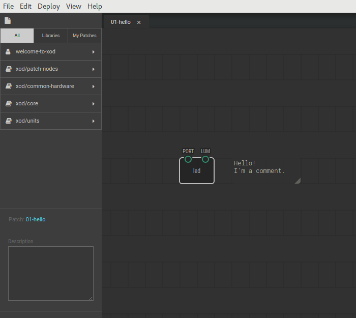
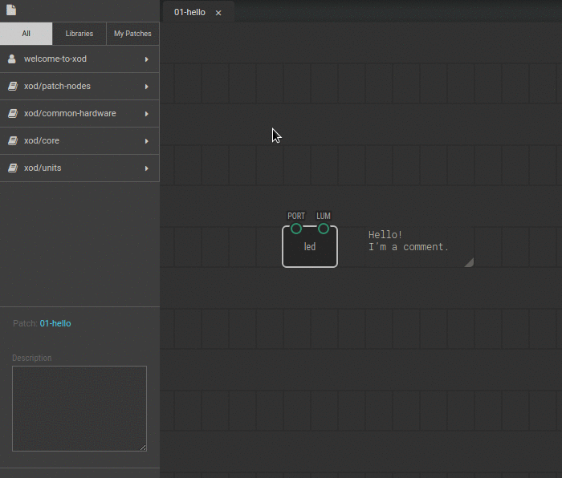

# #01. Welcome to XOD

Note
This is a web-version of a tutorial chapter embedded right into the XOD IDE.
To get a better learning experience we recommend to
<a href="../install/">install the IDE</a>, launch it, and you’ll see the
same tutorial there.

Welcome to XOD, dear Maker! Here, in XOD, we do not use text to code, but
visual objects instead.

The large gray field with a box is your program. It’s called a *patch*. In this
patch you can see only one interesting object – the `led` node — a grey
rectangle with two little green circles. You will be able to make complicated
programs, using these rectangles.

First, try to move it. Position on the patch board does not affect your program,
but can make it more readable.

You can see a comment as well. Even though it is there, it does not affect the
patch, because it is invisible to a machine. It’s only visible to you, a
clever human. You can drag it to move too.

## Instructions

1. On the left side you will find a list with available projects. The list is
   called a *Project Browser*. The first item in it is `welcome-to-xod`. This
   is a special tutorial project you’re working with right now. Expand the
   project by clicking on it.
2. As you can see, the `welcome-to-xod` project consists of many patches. Here
   we are at the patch `01-hello`. Next part of the Tutorial is in the patch
   `02-deploy`.  Double-click it to open the
   [next tutorial lesson](../02-deploy/).

