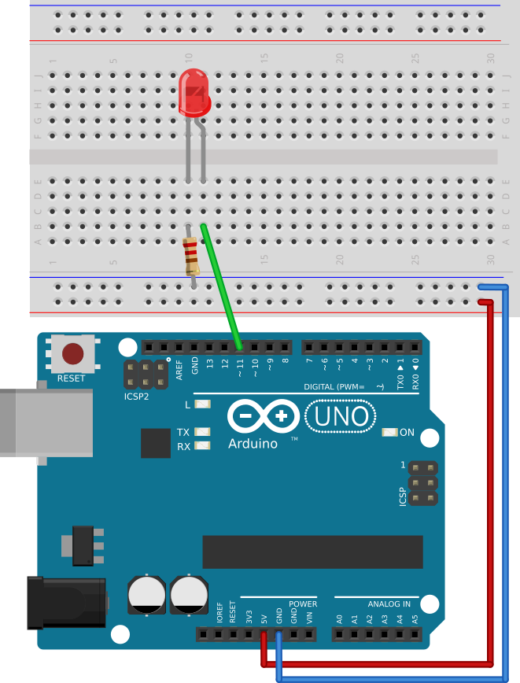

# #02. Upload to Arduino

Note
This is a web-version of a tutorial chapter embedded right into the XOD IDE.
To get a better learning experience we recommend to
<a href="../install/">install the IDE</a>, launch it, and you’ll see the
same tutorial there.

Sweet! Now let's upload your patch with the `led` node to Arduino! Here it is:

## Test circuit

[↓ Download as a Fritzing project](./circuit.fzz)

## Instructions for the desktop IDE

1. Assemble the circuit according to the picture above.
2. Connect Arduino to your computer.
3. Upload your first program. To do this, select “Deploy → Upload to Arduino”
   from the main menu.

## Instructions for the browser IDE

The browser version does not have permissions to access USB-ports. So you can’t
upload directly. However, you can use an existing Arduino IDE installation to
do this.

1. Assemble the circuit according to the picture above.
2. Generate Arduino source code of your first program. To do this, hit
   “Deploy → Show Code for Arduino”. Select all code and copy it to the
   clipboard.
3. Launch Arduino IDE and paste the code copied as is.
4. Select proper port and board in the “Tools” menu.
5. Click the “Upload” board on the Toolbar.

Note
If you’ve previously seen what code to blink an LED looks like for Arduino, you
might be astonished looking at the amount of code produced by XOD. Don’t worry
— most of it is code for the XOD runtime environment, which actually creates
little overhead after compilation. You don't need to understand how it
actually works. For now, think of it as a black box.

Feedback
Have a problem with uploading? Please report it on our <a
href="//forum.xod.io">forum</a>. Describe what you're doing, what you expect to
get, and what you actually get. We will help.

If you did it right way, you will see the LED turned on. Great! Proceed to the
[next lesson](../03-inspector).
