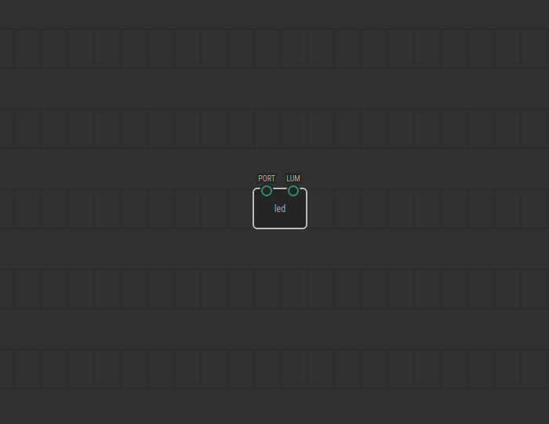

# #02. Upload to Arduino

Note
This is a web-version of a tutorial chapter embedded right into the XOD IDE.
To get a better learning experience we recommend to
<a href="../install/">install the IDE</a>, launch it, and you’ll see the
same tutorial there.

Sweet! Now let's upload your patch with the `led` node to Arduino! Here it is:

## Circuit

[↓ Download as a Fritzing project](./circuit.fzz)

## Instructions

1. Assemble the circuit according to the picture above.
2. Connect Arduino to your computer.
3. Upload your first program. To do this, select “Deploy → Upload to Arduino”
   from the main menu.

Note
To upload programs to Arduino you will need to install the Desktop version of
XOD. Browser version does not have permissions to access USB-ports.

If you did it right way, you will see the LED turned on. Great! Proceed to the
[next lesson](../03-inspector).
