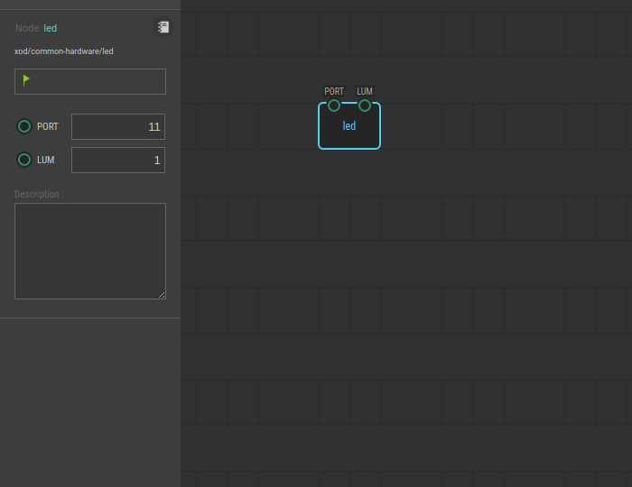
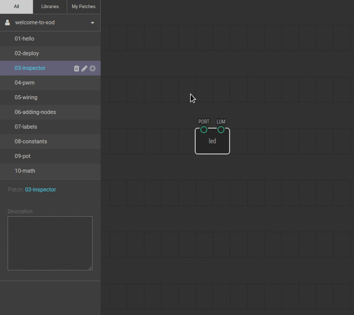

# #03. Pins, data, and the Inspector

Note
This is a web-version of a tutorial chapter embedded right into the XOD IDE.
To get a better learning experience we recommend to
<a href="../install/">install the IDE</a>, launch it, and you’ll see the
same tutorial there.

The LED is on because of the `led` node. Node is a visual representation of some
physical device (like ports on Arduino) or some function (adding, subtracting
and more complicated stuff).

Small colored circles on nodes are called *pins*. Pins are divided into inputs
and outputs. Inputs are always on the top side of nodes, outputs — on the
bottom.

The `led` is a simple LED controlling node. It can control only a one-colored
LED. The node has only input pins — `PORT` and `LUM`.

Pins are used to transfer data between nodes. Nodes can read and write that
data and produce a result. In our case, node transfers the fixed value on `LUM`
port to the port on Arduino. Number of Arduino port is defined by `PORT` value.

## Test circuit

Note
The circuit is the same as for the previous lesson.

[↓ Download as Fritzing project](./circuit.fzz)

## Instructions

1. Click on the `led` node. You will see the Inspector under the list of
   projects. You can set the node parameters in Inspector.
2. In Inspector, change the LUM value from 1 to 0.
3. Upload the program to Arduino. Again, select “Deploy → Upload to Arduino”
   from the menu.

After uploading the program, the LED on your board should turn off. It happened
because led node sen the value of 0 to certain (defined in `PORT`) port on
Arduino  – which means to stop voltage supply on that port.

When done, follow up to the [next lesson](../04-pwm).
