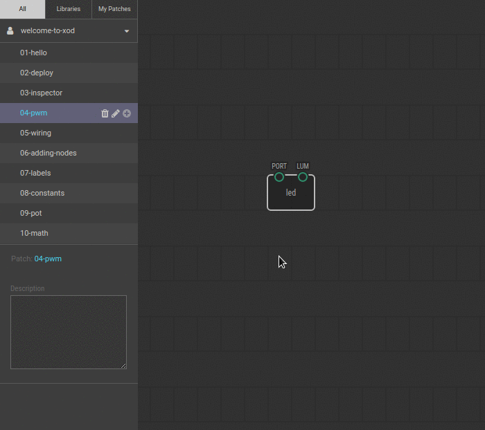

# #04. Fractional Numbers and PWM

Note
This is a web-version of a tutorial chapter embedded right into the XOD IDE.
To get a better learning experience we recommend to
<a href="../install/">install the IDE</a>, launch it, and you’ll see the
same tutorial there.

The LUM pin on led node can take values from 0 to 1. 0 means absolute minimum
of LED brightness. Basically, it means that LED is off. 1 means full
brightness. You can control LED brightness by setting fractional values on
`LUM` pin.

## Test circuit

Note
The circuit is the same as for the previous lesson.

[↓ Download as Fritzing project](./circuit.fzz)

## Instructions

1. Set the `LUM` to 0.4. To do this, click on the `led` node and type in the value
   in the Inspector.
2. Upload the patch to Arduino as you did it before.

Now LED is lightning not so bright. Feel free to try other values between 0 and
1 before moving on to the [next lesson](../05-wiring).
