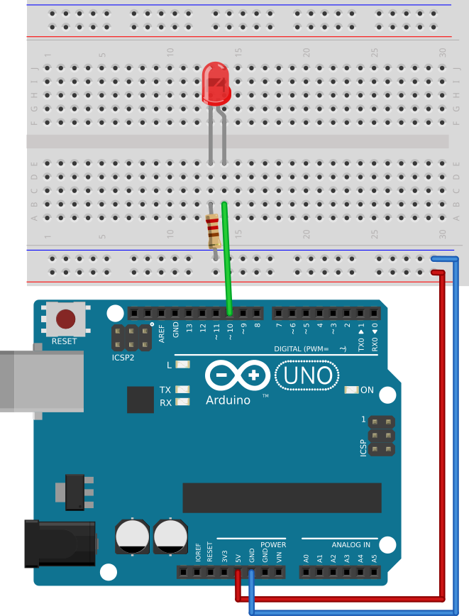

# #05. Wiring Configuration

Note
This is a web-version of a tutorial chapter embedded right into the XOD IDE.
To get a better learning experience we recommend to
<a href="../install/">install the IDE</a>, launch it, and you’ll see the
same tutorial there.

Now you know what the `LUM` pin does. However, an LED could be connected to any
digital port on an Arduino, so you need to inform the node of the port
number that you are about to use. You can do this with the `PORT` pin.

## Test circuit

Note
The circuit is the same as for the previous lesson.

[↓ Download as Fritzing project](./circuit.fzz)

## Instructions

1. Reconnect the LED to digital port 10 on the Arduino according to the scheme
   above.
2. Change the `PORT` value to 10 and the `LUM` value to 1.
3. Upload your patch to the Arduino.

The LED should turn on at the Arduino’s port 10.

`PORT` (the input) assigns the number of the Arduino’s digital port to be used
by this node, and `LUM` (whose value is between 0 and 1) controls the
brightness.

When done, follow to the [next lesson](../06-adding-nodes/).
