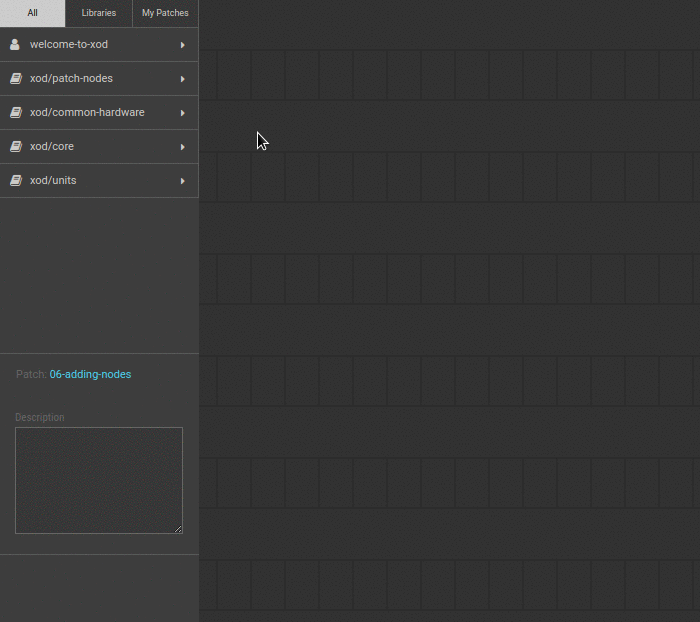

# #06. Adding Nodes

Note
This is a web-version of a tutorial chapter embedded right into the XOD IDE.
To get a better learning experience we recommend to
<a href="../install/">install the IDE</a>, launch it, and you’ll see the
same tutorial there.

Now, let’s turn on two LEDs together! You will need another `led` node.

## Test circuit

[↓ Download as a Fritzing project](./circuit.fzz)

## Instructions

1. Assemble the circuit according to the picture above.
2. In the node list (below the `welcome-to-xod` project), you will find the
   `xod/common-hardware` section. This is a *library* where you can find nodes
   for working with specific hardware.
3. Find the `led` node. Note that the nodes are arranged in alphabetical order.
4. Hover the cursor over the `led` node, and click the plus (+) symbol to add
   it to the patch.
5. Drag this node to any slot.
6. Now, assign the new values for the `PORT` and `LUM` pins to turn on the
   second LED.
7. Upload the patch to the Arduino.

Both LEDs should turn on now.

Alternatively, you may drag a node from the Project Browser instead of clicking
the (+) button. Try to add yet more `led` nodes to your project and then
proceed to the [next lesson](../07-labels/).
