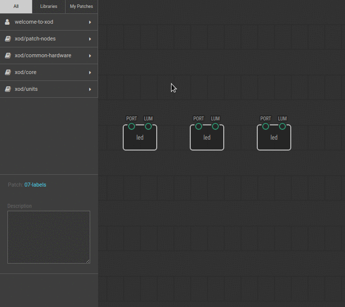

# #07. Node Labels

Note
This is a web-version of a tutorial chapter embedded right into the XOD IDE.
To get a better learning experience we recommend to
<a href="../install/">install the IDE</a>, launch it, and you’ll see the
same tutorial there.

From the previous experiments we have two led nodes. They have identical names
but control different LEDs. To add some clarity, let’s rename them!

## Test circuit

Note
The circuit is the same as for the previous lesson.

[↓ Download as Fritzing project](./circuit.fzz)

## Instructions

1. Click on any node. There is a field with a green flag in the Inspector; you
   can find it above the pins. Type any name for the node into this field.
2. Do the same for the second node.

Now the names of the nodes are different, and you can easily distinguish one
from the other. However, the function and type of each node remains the same.
This feature just makes your patch more readable.

OK, now you know how to put things in order. Let’s skip to the [next
lesson](../08-constants/).
