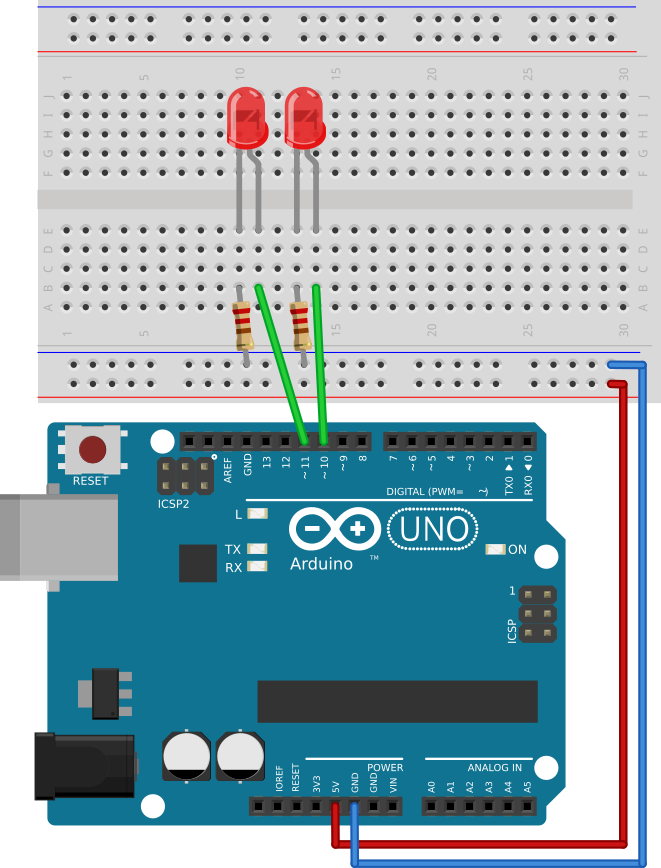
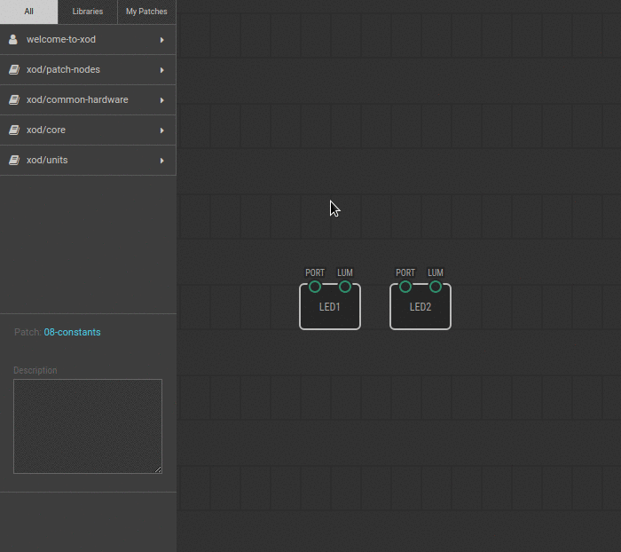

# #08. Constant Nodes

Note
This is a web-version of a tutorial chapter embedded right into the XOD IDE.
To get a better learning experience we recommend to
<a href="../install/">install the IDE</a>, launch it, and you’ll see the
same tutorial there.

Before this experiment, we specified the node values manually with the
Inspector. However, the data can be transferred from the output pin to the
input pin of every node. This is the core idea of all node-based visual
programming, including XOD.

## Test circuit

Note
The circuit is the same as for the previous lesson.

[↓ Download as Fritzing project](./circuit.fzz)

## Instructions

1. Click on the `constant-number` node, and specify a value for the `VAL`
   output pin.
2. Connect the `VAL` pin with the `LUM` pin on the LED1 node. To do this,
   simply click on the `VAL` pin and then on the `LUM` pin. You will then see a
   green line connecting the two pins. This line is called a *link*.
3. Do the same with the LED2 node.
4. Upload the patch to the Arduino.

Now, both LEDs are on. However, the value of the `LUM` pin is transferred from
the `VAL` pin of the `constant-number` node.

The `constant-number` node transfers data to the `VAL` pin. You can specify the
data in the Inspector. Try to change values of the constant and upload again.
See how LEDs’ brightness changes.

When played enough follow to the [next lesson](../09-pot/).
