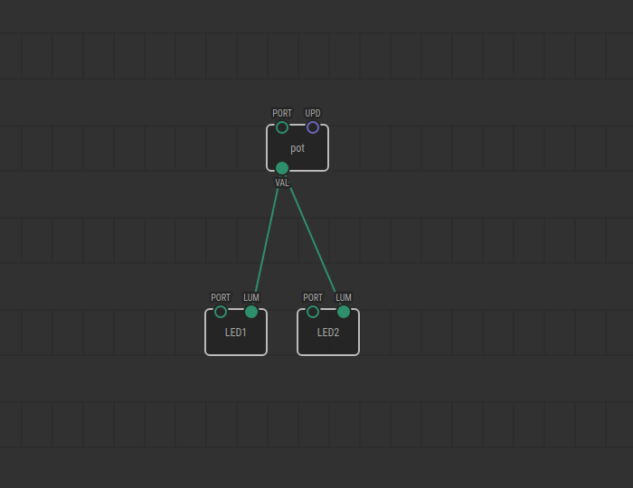
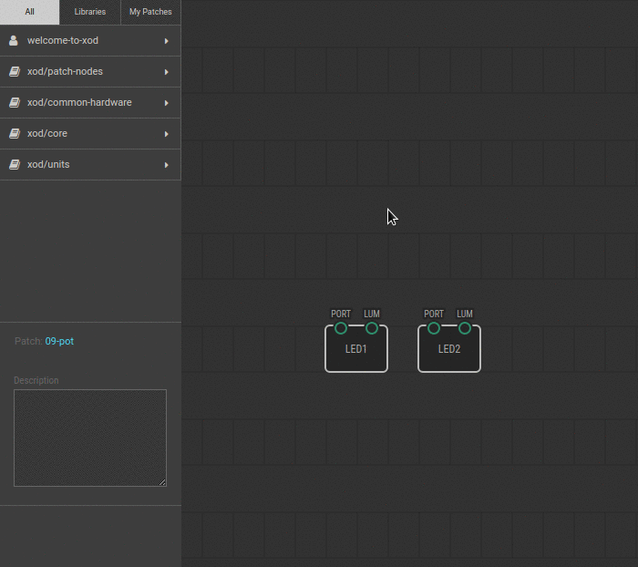

# #09. Input from a Potentiometer

Note
This is a web-version of a tutorial chapter embedded right into the XOD IDE.
To get a better learning experience we recommend to
<a href="../install/">install the IDE</a>, launch it, and you’ll see the
same tutorial there.

Let’s try some more practice. Now, we will control the LEDs’ brightness with a
potentiometer. All you need to do is to replace the `constant-number` node from the
previous lesson with a `pot` node and transfer the brightness value to LED1 and LED2
from this pot node instead of the `constant-number`.

## Test circuit

Note
The circuit is the same as for the previous lesson.

[↓ Download as Fritzing project](./circuit.fzz)

## Instructions

1. Delete the links between the pins. To do this, click on a link, then press
   either Delete or Backspace key.
2. Delete the `constant-number` node. Click on it and press Delete or
   Backspace.
3. Find the `pot` node in the Project Browser inside the `xod/common-hardware`
   library.
4. Connect a potentiometer to the Arduino according to the scheme above.
5. Set the `PORT` pin value on the `pot` node to 0, bacause it’s connected to
   analog Arduino port A0.
6. Link the `pot` node `VAL` pin to the `LUM` pins on the LED1 and LED2 nodes.
7. Upload the patch to the Arduino.

If you turn the potentiometer knob, it will affect the brightness of the LEDs.
Depending on the angle of the knob, the `pot` node returns a value from 0.0 to
1.0 to the `VAL` pin, and that value is transferred to the `LUM` pins of both
LED nodes.

When done continue to the [next lesson](../10-math/).
