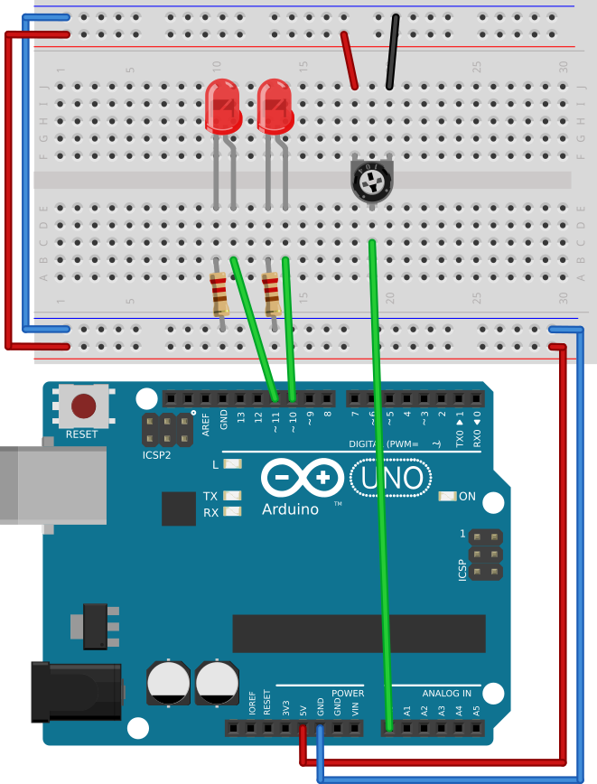

# #09. Input from a Potentiometer

Note
This is a web-version of a tutorial chapter embedded right into the XOD IDE.
To get a better learning experience we recommend to
<a href="../install/">install the IDE</a>, launch it, and you’ll see the
same tutorial there.

(TODO: transfer → link in the project)

Let’s try some more practice. Now, we will control the LEDs’ brightness with a
potentiometer. All you need to do is to replace the `constant-number` node from the
previous lesson with a node for a potentiometer and link its output value, just
like we did in the previous patch.

## Test circuit

Note
The circuit is the same as for the previous lesson.

[↓ Download as Fritzing project](./circuit.fzz)

## Instructions

(TODO: DEL or Backspace in the project)

1. Delete the links between the pins. To do this, click on a link, then press
   either Delete or Backspace key.
2. Delete the `constant-number` node. Click on it and press Delete or
   Backspace.
3. Find the `pot` node in the Project Browser. It is located in
   `xod/common-hardware`.
4. Connect the potentiometer to the Arduino according to scheme above.
5. Define the value of `PORT` according to the potentiometer pin (A0).
   To refer A0 just use value of 0.
6. Link the `VAL` pins to the `LUM` pins on the LED1 and LED2 nodes.
7. Upload the patch to the Arduino.

If you turn the potentiometer knob, it will affect the brightness of the LEDs.
Depending on the angle of the knob, the `pot` node returns a value
from 0–1 to the `VAL` pin, and that value is transferred to the `LUM` pins of
both LED nodes.

When done continue to the [next lesson](../10-math/).
