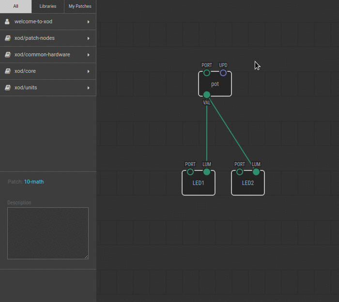

# #10. Doing Math

Note
This is a web-version of a tutorial chapter embedded right into the XOD IDE.
To get a better learning experience we recommend to
<a href="../install/">install the IDE</a>, launch it, and you’ll see the
same tutorial there.

You probably noticed that there is a `UPD` input pin on the pot node and that
it’s blue.

The pin’s color indicates the *type* of data that this pin is compatible with.
Green pins can take and return numerical values. Blue pins work with pulses, a
special data type that we will return to later.

Let's try to do some math.

As you can guess, the `multiply` node transfers the results of the multiplication
of the numbers from the `X` and `Y` pins to the `PROD` pin.

## Test circuit

Note
The circuit is the same as for the previous lesson.

[↓ Download as a Fritzing project](./circuit.fzz)

## Instructions

1. Delete the link between the `pot` node and LED2.
2. Link the pot `VAL` pin to the `X` pin of the `multiply` node. Then, connect the
   `PROD` pin to the `LUM` pin on LED2.
3. Upload the patch to the Arduino.

Turn the potentiometer knob. The LED on port 11 will reach the maximum
brightness with a half-turn of the knob. This happens because the `multiply` node
multiplied the values of `X` and `Y`, and transferred them to the `PROD` pin. As
`Y` was set to 2 in the Inspector, the value of the `pot` node doubles before
reaching the `LUM` pin of LED2.

In `xod/core`, you will find nodes for different mathematical and trigonometric
calculations.

Try other operators like `add`, `subtract`, `divide`. When ready proceed to the
[next lesson](../11-servo/).
