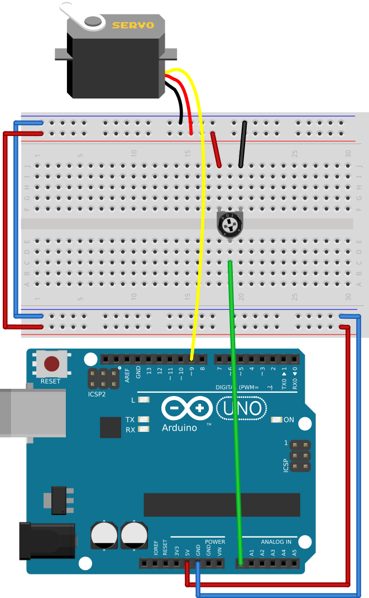
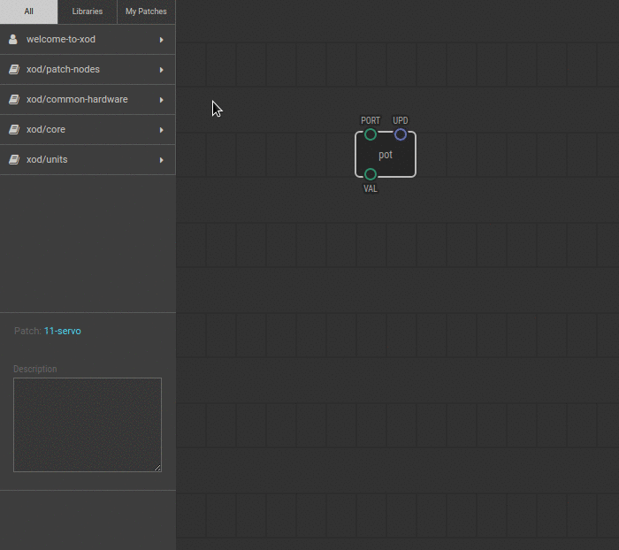

# #11. Controlling Servos

Note
This is a web-version of a tutorial chapter embedded right into the XOD IDE.
To get a better learning experience we recommend to
<a href="../install/">install the IDE</a>, launch it, and you’ll see the
same tutorial there.

Controlling servos in XOD is just as easy as controlling LEDs. There is a
special node called `servo`. You will find it in `xod/common-hardware`.

## Test circuit

Note
The circuit is the same as for the previous lesson.

[↓ Download as Fritzing project](./circuit.fzz)

## Instructions

(TODO: remove word node from (1) item in the project)

1. Connect the servo to the Arduino as shown on the image above.
2. Link the `VAL` pin of the `pot` node to the `VAL` pin of the servo node.
3. Upload the patch to the Arduino.

Done! Turn the potentiometer knob, and watch the servo turn, too!

The `servo` node is designed to control servos. `PORT` specifies the number of
the digital port on the Arduino that the servo is connected to.

`VAL` has a value ranging from 0–1; it turns the servo shaft from 0–180
degrees.

When the fun is over get another portion in the [next lesson](../12-help/).
