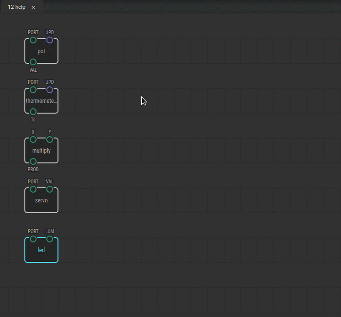

# #12. Accessing Help

Note
This is a web-version of a tutorial chapter embedded right into the XOD IDE.
To get a better learning experience we recommend to
<a href="../install/">install the IDE</a>, launch it, and you’ll see the
same tutorial there.

Actually, we were lucky in the previous patch because the range of values from `pot`
(0–1) matched the range accepted by the `servo` node. However, that doesn’t
always happen. Often, value ranges on different nodes are incompatible,
and we need to match them.

## Instructions

1. Find out the range of the `Tc` output on the thermometer node. To do so,
   click the node, and then click the book icon in the Inspector. You will see
   a help page. The other way to do it is to click on the node and then press
   the H key.
2. Read the description. Every node description contains information about the
   input and output ranges and the types of data.

Now you can figure out the node range by yourself; you just need to read the help page.

Read help articles on few other nodes you wish and proceed to the [next
lesson](../13-map/).
