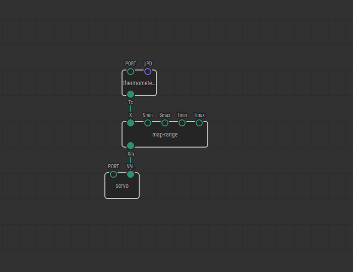
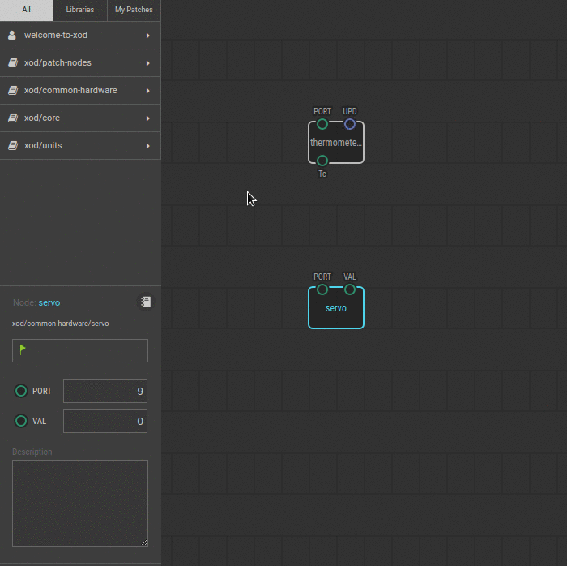

# #13. Mapping Values

Note
This is a web-version of a tutorial chapter embedded right into the XOD IDE.
To get a better learning experience we recommend to
<a href="../install/">install the IDE</a>, launch it, and you’ll see the
same tutorial there.

If you have finished the previous experiment, you will have noticed that the
thermometer node returns an output temperature value to the `Tc` pin in degrees
Celsius. The `servo` node can work only with the values of range 0–1 (0 is 0°,
1 is 180°).

The practical task is to make the servo rotate smoothly from 0–90 degrees,
reflecting a temperature change from 20°C to 30°C.

(TODO: no tragedy in the project)

You can actually do this using few math nodes, but we have a special node for
such cases. This node is called the `map-range` node.

## Test circuit

Note
The circuit is the same as for the previous lesson.

[↓ Download as Fritzing project](./circuit.fzz)

## Instructions

1. Link the `Tc` pin to the `X` pin on the `map-range` node.
2. Define the input range. In our case, it will be numbers from 20–30. Open the
   Inspector for the `map-range`, and then set `Smin` to 20 and `Smax` to 30.
3. Define the output range. You know the range for the servo node. 90° is 0.5
   on the `VAL` pin, so set `Tmin` and `Tmax` accordingly (you know how).
4. Done! Link the `Xm` output to the `VAL` servo input.
5. Upload to the Arduino.

Try to heat the thermometer with your finger. At a temperature of 25°C (half
the input range), the servo should rotate to 45°, which is half the output
range.

We’ll do more practice with the `map-range` in the [next
lesson](../14-map-adjust/).
