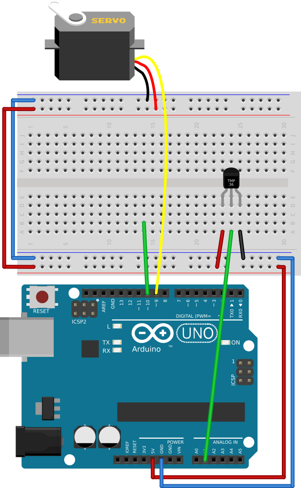

# #14. Adjusting Map Range

Note
This is a web-version of a tutorial chapter embedded right into the XOD IDE.
To get a better learning experience we recommend to
<a href="../install/">install the IDE</a>, launch it, and you’ll see the
same tutorial there.

After the previous lesson, the `map-range` node linearly maps the
20–50°C range to 0–90°.

Now, try to make the servo rotate smoothly from 0 to 180° when the temperature
changes from 10°C to 50°C.

## Test circuit

Note
The circuit is the same as for the previous lesson.

[↓ Download as a Fritzing project](./circuit.fzz)

## Instructions

1. Set the input range (`Smin` and `Smax`) to 10–50.
2. Set the output range (`Tmin` and `Tmax`) to 0–1.
3. (Optional) If you prefer °F, you can easily translate the data from the
   thermometer with the `c-to-f` node from `xod/units`. The range will be
   50–122°F.
4. Upload.

Now the servo is more sensitive to the changes of the temperature sensor.

You will use the `map-range` node quite often. It is located in `xod/core`.

Try to play with the map values and when done follow to the [next
lesson](../15-buttons/).
