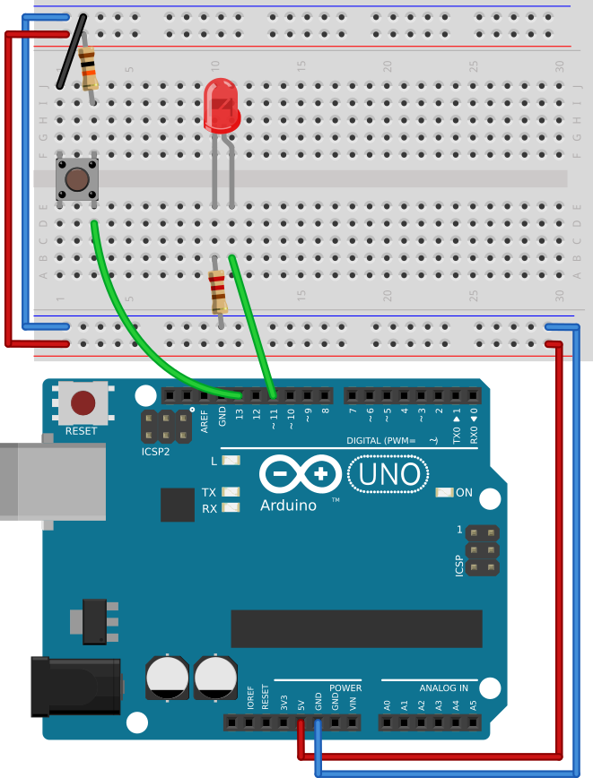

# #15. Buttons

Note
This is a web-version of a tutorial chapter embedded right into the XOD IDE.
To get a better learning experience we recommend to
<a href="../install/">install the IDE</a>, launch it, and you’ll see the
same tutorial there.

So: buttons, here we are!

We have already added the `button` node from `xod/common` hardware. As you
remember, in that library, you can find nodes for working with specific
hardware.

The button node has a purple output pin called the `PRS`. This pin returns a new
type of data: *Boolean*.

(TODO: conditions → states in the proj)

Boolean data can have only two states: true or false.
In our case, the `button` node returns a value of `false` when idle and `true`
while the button is being pressed.

Good news, everyone! In XOD, some types of data are compatible with others.
Booleans and numbers are just two of them. Here are some basic rules of
datacasting:

* If you send a boolean (purple) `false` to a numeric (green) input, it will be
  interpreted as a numeric 0.
* If you send a boolean `true`, it will be interpreted as a numeric 1.
* If you send any numeric value except 0 to a boolean (purple) input, it will
  be interpreted as `true`.
* And if you send numeric 0, it will be interpreted as boolean `false`.

## Test circuit

Note
The circuit is the same as for the previous lesson.

[↓ Download as Fritzing project](./circuit.fzz)

## Instructions

1. Assemble the circuit.
2. Link the `PRS` pin to the `LUM` pin.
3. Upload your patch.

Press the button. The `button` node transfers the `true` value, the `led` node
interprets it as 1, and the LED turns on at full brightness.

Send a WOW morse-signal with the button and go to the [next lesson](../16-logic).
