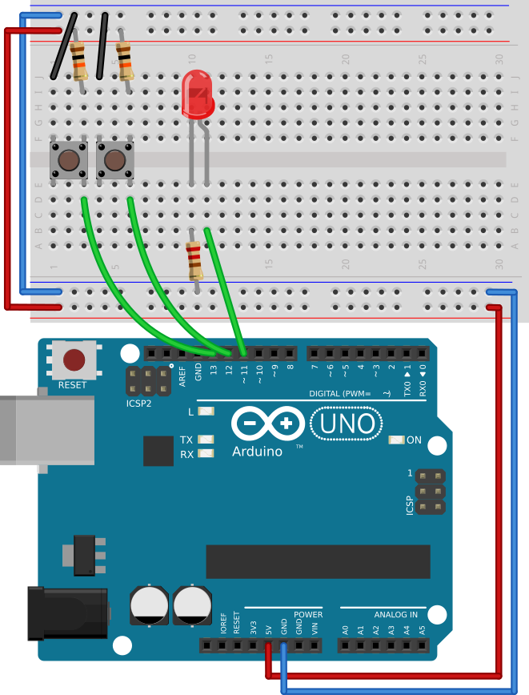

# #16. Logic Nodes

Note
This is a web-version of a tutorial chapter embedded right into the XOD IDE.
To get a better learning experience we recommend to
<a href="../install/">install the IDE</a>, launch it, and you’ll see the
same tutorial there.

Boolean values are cool. You can use them to construct complex logic systems.
In XOD, you will find a lot of nodes for this purpose. All of them are located
in `xod/core`.

* `and` returns `true` if both A *and* B are `true`
* `or` returns `true` if A, B, or both are `true`
* `not` inverts the input value

## Test circuit

Note
The circuit is the same as for the previous lesson.

[↓ Download as a Fritzing project](./circuit.fzz)

## Instructions

1. Assemble the circuit with two buttons and an LED as shown above.
2. Upload the patch to the Arduino.

The `and` node returns `false` until both buttons are pressed. The `not` node
inverts the value from the `and` node, so the `LUM` pin receives its `true`
value (1). Thus, the LED turns on.

Pressing one of the buttons changes nothing. The LED will turn off only when
the `LUM` pin receives false (0). This will happen only if the `not` node
receives the true value, which is possible only if both buttons are pressed at
the same time.

Explore other logic nodes by yourself using node help.

After that jump to the [next lesson](../17-ldr/).
