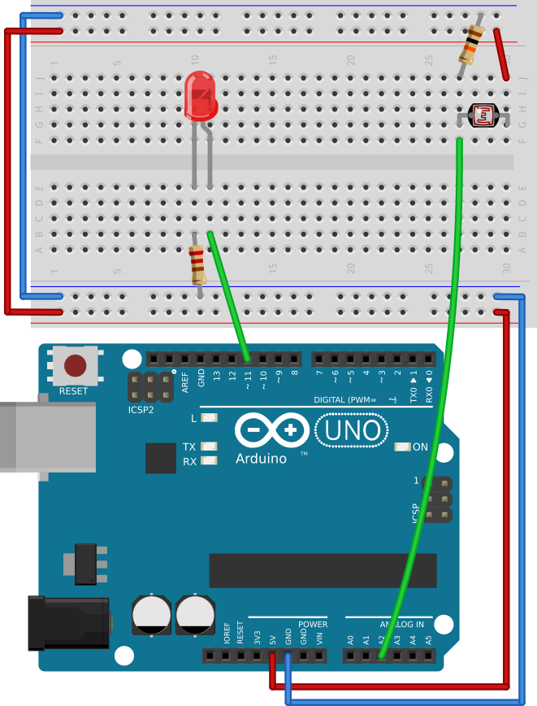

# #05. Reading lightness

Note
This is a web-version of a tutorial chapter embedded right into the XOD IDE.
To get a better learning experience we recommend to
<a href="../install/">install the IDE</a>, launch it, and you’ll see the
same tutorial there.

Now, let's learn how to work with conditionals in XOD.

We will measure something, and if the values exceed or are below the threshold,
we will turn an LED on or off.

A photoresistor (aka light dependent resistor or LDR) would do a great job of
measuring the light level. However, there is a small problem: we do not have a
photoresistor node in XOD.

Yet, we have basic nodes for working with the digital and analog ports of the
Arduino. A photoresistor is a pretty primitive device, and all we need to do is
read its value from the analog port on the Arduino. To do so, we will use an
`analog-input` node.

## Test circuit

[↓ Download as a Fritzing project](./circuit.fzz)

## Instructions

1. Assemble the circuit.
2. Find the `analog-input` node in `xod/core` and add it to the patch.
3. Read the description of the node on the help page. Pay attention to the
   range of values the node returns.
4. Link the `VAL` output pin of the `analog-input` node to the `LUM` pin.
5. Upload the patch to the Arduino.

Cover the photoresistor with your hand, and watch how the brightness of the LED
changes.

When done follow to the [next lesson](../18-comparisons/).
