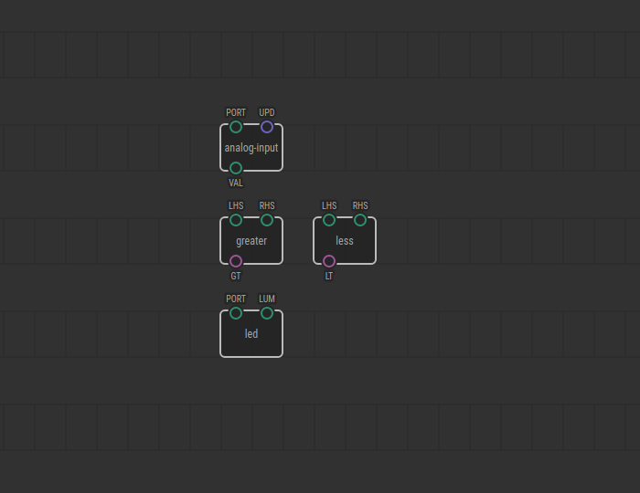
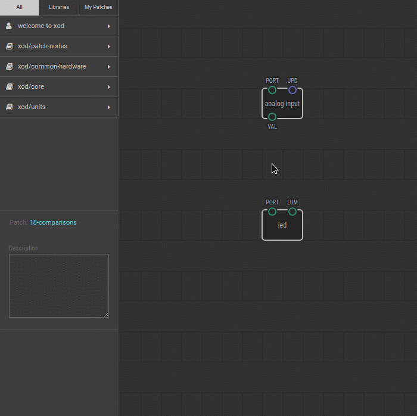

# #18. Comparing Numbers

Note
This is a web-version of a tutorial chapter embedded right into the XOD IDE.
To get a better learning experience we recommend to
<a href="../install/">install the IDE</a>, launch it, and you’ll see the
same tutorial there.

Now for comparisons. XOD has `greater`-than and `less`-than nodes to do simple
mathematical comparisons.

## Test circuit

Note
The circuit is the same as for the previous lesson.

[↓ Download as a Fritzing project](./circuit.fzz)

## Instructions

1. Link the `VAL` pin of the `analog-input` node to the `LHS` pin on the
   `greater` node.
2. Set a value of 0.4 on the `RHS` pin. You can still do this in the Inspector.
   This is the value we will compare the photoresistor value with.
3. Link the `GT` pin on the `greater` node to the `LUM` pin of the `led` node.
4. Upload the program.

Now, if the `analog-input` node (our photoresistor) returns a value greater
than 0.4, the `greater` node will set the `GT` pin to `true`, and the LED will
turn on.

Try to set the comparison value manually using a potentiometer. Tips:

1. Connect the potentiometer and add another `analog-input` node from
   `xod/core`. Define the `PORT` value for the Arduino port that the
   potentiometer is connected to.
2. Link the output of this node to the `RHS` pin of the `greater` node.

Now the threshold value is not fixed but is defined by the potentiometer.

Success? Follow to the [next lesson](../19-if-else/).
