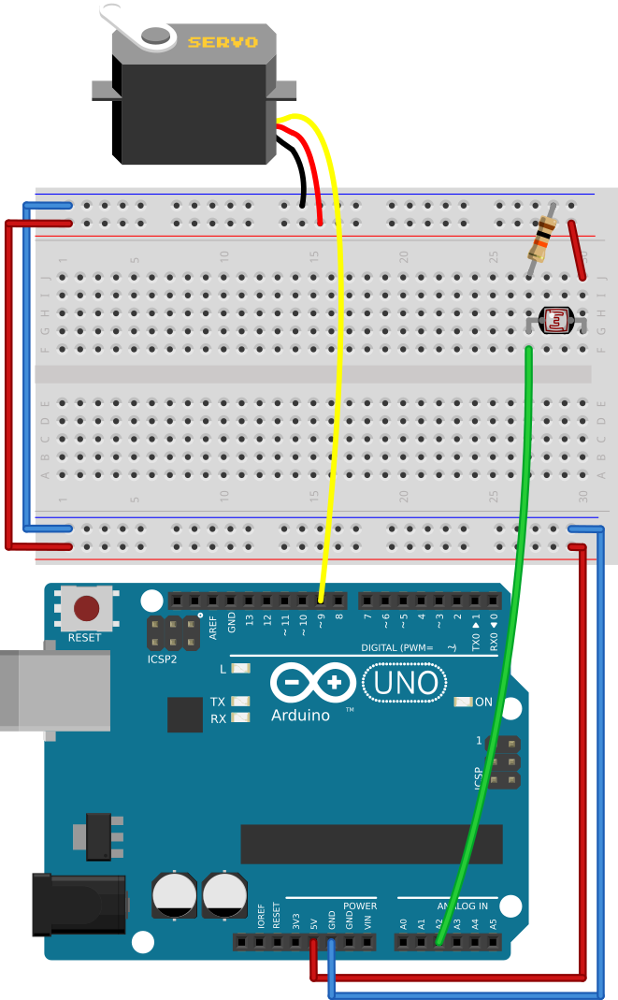

# #19. If-else branching

Note
This is a web-version of a tutorial chapter embedded right into the XOD IDE.
To get a better learning experience we recommend to
<a href="../install/">install the IDE</a>, launch it, and you’ll see the
same tutorial there.

All the comparison nodes return `true` or `false`.

Sometimes, you need to turn the servo to a certain angle when your comparison
node returns only `true` or `false` (which map to 0° or 180°). How can we make
that work?

There is an `if-else` node in `xod/core`. The `COND` pin of this node checks
the boolean input value. If `COND` receives `true`, the node returns the value
from the `T` pin to the `R` pin. When it receives `false`, it returns the value
from the `F` pin.

## Test circuit

Note
The circuit is the same as for the previous lesson.

[↓ Download as Fritzing project](./circuit.fzz)

## Instructions

1. Assemble the circuit as shown above.
2. Define the value on the `RHS` pin of the `greater` node. This value will be
   compared to the value from the photoresistor.
3. Define the values for the `T` and `F` pins on the `if-else` node. These values
   will be sent to the servo. Remember about the value range of the servo
   node: 45° of the servo will be 0.25, and 135° will be 0.75.
4. Upload the patch to the Arduino.

Now, if the comparison condition is true, the servo will turn to the angle from
the `T` pin of the `if-else` node or, otherwise, to the angle from the `F` pin
of the same node.

Play with values and then go to the [next lesson](../20-fade/).
